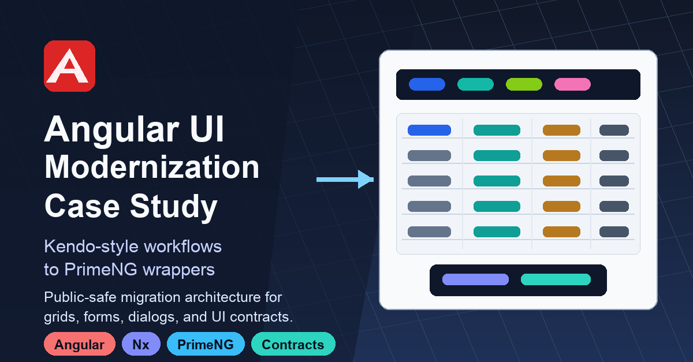
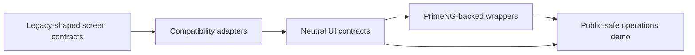

# Angular UI Modernization Case Study

Public portfolio case study by Kamil Furtak, Senior Angular Engineer.

This repository presents an enterprise Angular UI modernization slice: preserving dense Kendo-style workflows while moving rendering behind neutral contracts and PrimeNG-backed wrappers.

The production-grade implementation remains private. This public repository is intentionally curated for portfolio review: architecture, decisions, screenshots, and public-safe migration notes only.

## The Challenge

Enterprise Angular applications rarely fail modernization because a new UI library cannot render a button or table. They fail because mature screens depend on accumulated behavior:

- grid state, filters, sorting, paging, selection, and row styling;
- toolbar actions, dropdowns, toggles, payloads, and multi-row workflows;
- dialogs/windows, confirmations, previews, uploads, and document flows;
- Formly-style forms, map/range actions, communication panels, and shared UI contracts;
- stable selectors and APIs used across existing feature modules.

A direct rewrite pushes that risk into every screen. The goal here was to create a migration boundary that keeps behavior reviewable, typed, and incremental.

## The Approach

I used a three-layer model:

- Neutral UI contracts for tables, toolbars, dialogs, forms, files, maps, and interaction state.
- Compatibility adapters for legacy-shaped selectors, inputs, outputs, services, and models.
- PrimeNG-backed wrappers that render the new UI while keeping app-facing contracts stable.
- A public-safe operational demo that proves the pattern with fake data and realistic workflows.

## Architecture

The important idea is the migration boundary: feature screens can keep familiar app-level contracts while rendering moves to a new component system behind adapters and reusable wrappers.

## What This Demonstrates

- Angular/Nx architecture with separated UI contracts, compatibility adapters, and PrimeNG-backed wrappers.
- Grid-first operational UX: selection, dependent tabs, dialogs, uploads, map/range actions, messages, and event history.
- Migration thinking across grids, forms, dialogs, documents, maps, files, and shared UI contracts.
- A reusable-library mindset: PrimeNG details stay inside wrapper components instead of leaking into every feature screen.
- Public-safe presentation: no customer data, no private endpoints, no copied implementation, and no private repository history.

## Featured Screens

### Prime Migration Workbench

A dense back-office screen centered on a master grid, dependent records, toolbar actions, selected-row context, local dialogs, document flows, status indicators, and public-safe fake data.

### Grid And Detail Workflow

A focused view of the migration boundary in action: search form, action toolbar, selected row, status tones, detail panel, and local workflow actions in one operational layout.

### Starter Workbench

A smaller starter view used to present the migration shell, scenario navigation, and public-safe proof surface before the full operational scenario was expanded.

## My Role

I owned the case study end to end:

- researched the legacy-shaped UI surface and grouped it into migration families;
- designed the architecture around UI-neutral contracts, compatibility adapters, and PrimeNG wrappers;
- implemented Angular standalone components, services, directives, pipes, and typed manifests in the private working repository;
- built the public-safe operational showcase;
- cleaned public naming and documentation so the portfolio version can stand apart from employer-specific or customer-specific history.

## Public Boundary

This repository intentionally excludes private source code, customer names, production routes, endpoint URLs, credentials, real internal screenshots, private repository history, and copied implementation details.

The implementation can continue privately as a reusable PrimeNG-oriented library while this repository remains a clean public case study.

## Links

- GitHub: https://github.com/kamilfurtak
- LinkedIn: https://linkedin.com/in/kamilfurtak
- Medium: https://medium.com/@kamilfurtak
- ng-openlayers: https://github.com/kamilfurtak/ng-openlayers
