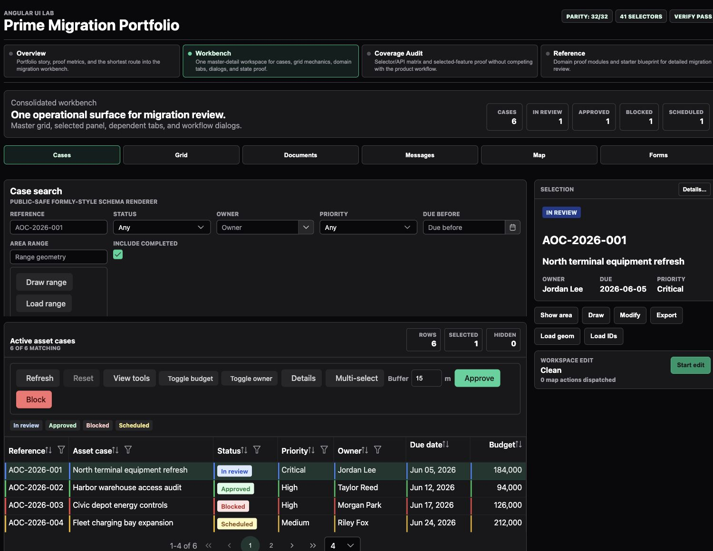
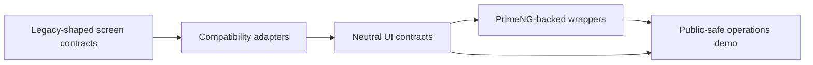
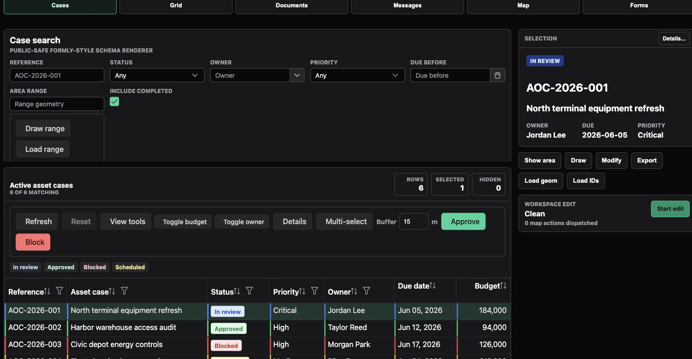
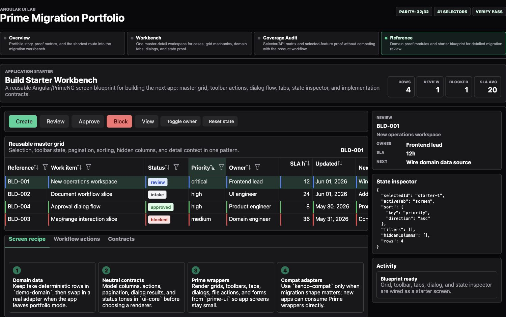

# Angular UI Modernization Case Study

Public portfolio case study by Kamil Furtak, Senior Angular Engineer.

This repository documents an enterprise Angular UI modernization slice: preserving dense Kendo-style workflows while moving rendering behind neutral contracts and PrimeNG-backed wrappers.

The production-grade implementation remains private. This repository is intentionally curated for portfolio review: architecture, decisions, screenshots, validation evidence, and public-safe notes only.

## What This Shows

- Enterprise frontend modernization without a risky rewrite.
- Angular/Nx architecture with separated UI contracts, compatibility adapters, and PrimeNG-backed wrappers.
- Grid-first operational UX: selection, dependent tabs, dialogs, uploads, map/range actions, messages, and event history.
- Migration thinking across grids, forms, dialogs, documents, maps, files, and shared UI contracts.
- Public-safe presentation: no customer data, no private endpoints, no copied implementation, and no private repository history.

## Architecture

The important idea is the migration boundary: feature screens can keep familiar app-level contracts while rendering moves to a new component system behind adapters and reusable wrappers.

## Featured Screens

### Prime Migration Workbench

A dense back-office screen centered on a master grid, dependent records, toolbar actions, selected-row context, local dialogs, document flows, status indicators, and public-safe fake data.

### Grid And Detail Workflow

A focused view of the migration boundary in action: search form, action toolbar, selected row, status tones, detail panel, and local workflow actions in one operational layout.

### Starter Workbench

A smaller starter view used to present the migration shell, scenario navigation, and public-safe proof surface before the full operational scenario was expanded.

## Repository Contents

- [Case Study](docs/case-study.md)
- [Architecture](docs/architecture.md)
- [Validation](docs/validation.md)
- [Public-Safety Boundary](docs/public-safety.md)

## Links

- GitHub: https://github.com/kamilfurtak
- LinkedIn: https://linkedin.com/in/kamilfurtak
- Medium: https://medium.com/@kamilfurtak
- ng-openlayers: https://github.com/kamilfurtak/ng-openlayers
