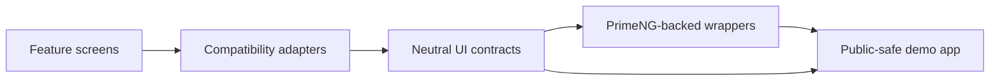

# Architecture

## Design Goal

The migration architecture separates app-facing behavior from the UI library that renders it. PrimeNG is treated as the rendering technology, not as the contract that every feature screen must know.

## Layer Responsibilities

| Layer | Responsibility |
|---|---|
| Neutral UI contracts | Shared table state, selection, toolbar payloads, dialog results, upload/file models, map/range events, form schemas, and layout contracts. |
| Compatibility adapters | Legacy-shaped Angular selectors, inputs, outputs, services, pipes, and migration metadata. |
| PrimeNG wrappers | Reusable components that translate neutral contracts into PrimeNG rendering and events. |
| Demo application | Public-safe operational workflows with deterministic fake data and visible proof actions. |

## Why This Boundary Helps

The boundary allows migration work to happen in reviewable layers:

- preserve selectors and API shapes that existing Angular templates rely on;
- normalize state and payloads before they reach rendering components;
- keep PrimeNG imports and implementation details inside the reusable UI layer;
- avoid coupling wrappers to customer data, internal DTOs, routes, or endpoints;
- prove workflows through a public-safe showcase before applying the pattern to real screens.

## Example Workflow Shape

1. A legacy-shaped screen emits table state, toolbar actions, or dialog intent.
2. The compatibility layer maps that input into a neutral UI contract.
3. PrimeNG-backed wrappers render the table, toolbar, dialog, upload panel, tree list, or form.
4. The wrapper emits normalized events back to the host.
5. The host keeps control of business logic, data ownership, and persistence.

## UX Principle

The demo intentionally keeps a dense operational feel. It is grid-first, compact, and action-oriented because enterprise modernization must preserve daily working ergonomics:

- data table as the primary anchor;
- dependent tabs and selected-row context;
- compact toolbar actions close to the data;
- dialogs/windows for detail, preview, confirmation, and multi-step actions;
- restrained styling that supports scanning and repeated use.
